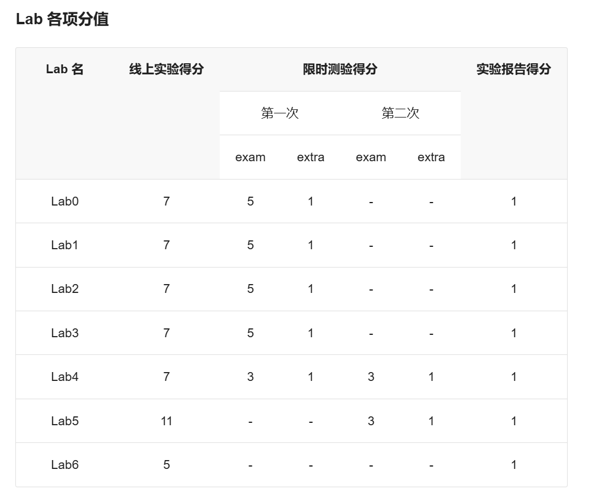

# OS
这是 fyy 的2024年春北航编译技术实验课程

OS 理论和实验各占 50%, 期中理论得分来自出勤，期中考试和期末考试

实验得分如下：

实验的挑战性任务是选做，占实验部分成绩的 6 分
### 分支结构说明
2024春OS课上课下实验共24个（除挑战性任务，包含三次不算入成绩的 pre 实验），下面是各分支含义：
* pre 表示不算成绩的三个预习实验
* lab_x 表示课下 lab_x 实验
* lab_x-exam 表示 lab_x 课上上机基础部分
* lab_x-extra 表示 lab_x 课上上机附加部分
* challenge 表示挑战性任务
* report 里面放着每次实验和挑战性任务的实验报告
* homework 表示课下理论作业
* exam 里面有 OS 期中和期末考试的真题 ~~~

### 每个分支细节说明
所有内容不能保证 100% 正确，若有疑问请联系作者（若作者不回复，则说明~~作者也不会~~ 作者很忙）
* 对于lab分支，所有lab分支的课下实验通过，所有课上上机的 exam 通过，extra 则不保证全对。。。 ~~本人太菜~~
* 对于挑战性任务，本人选择的是 Shell 挑战性任务，差一个功能未实现得分 80%，具体情况可查看 challenge 分支
* homework 分支放的理论作业是王雷老师班上的，可简单参考
* report 里的实验报告可以适当参考，还是要有自己的思考总结，会对课程学习有较大帮助
